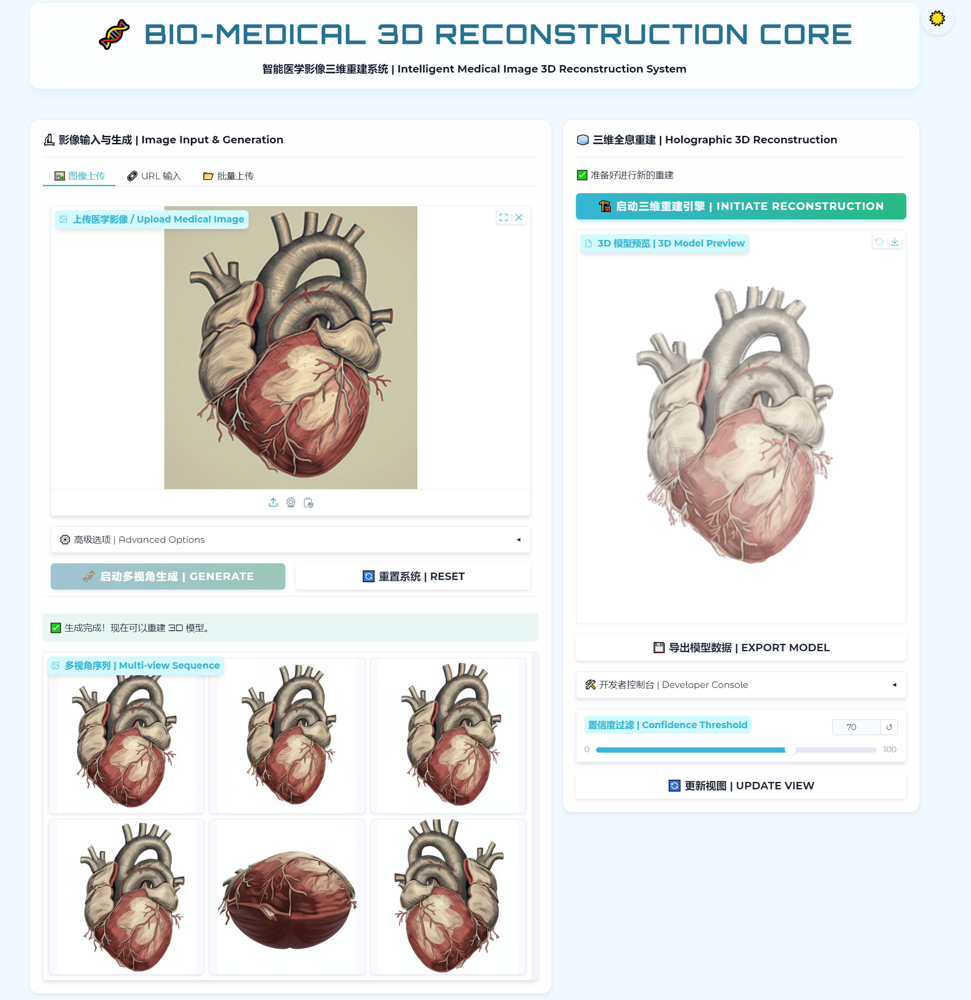
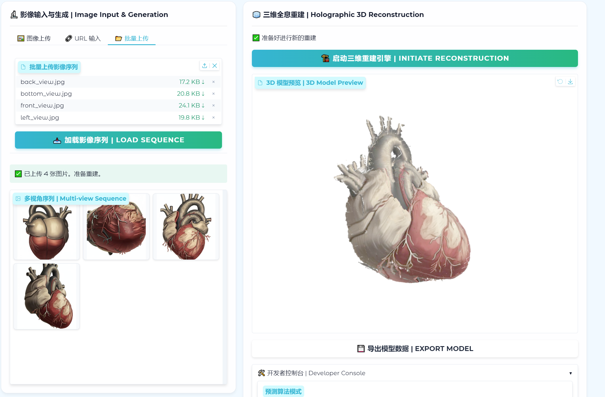
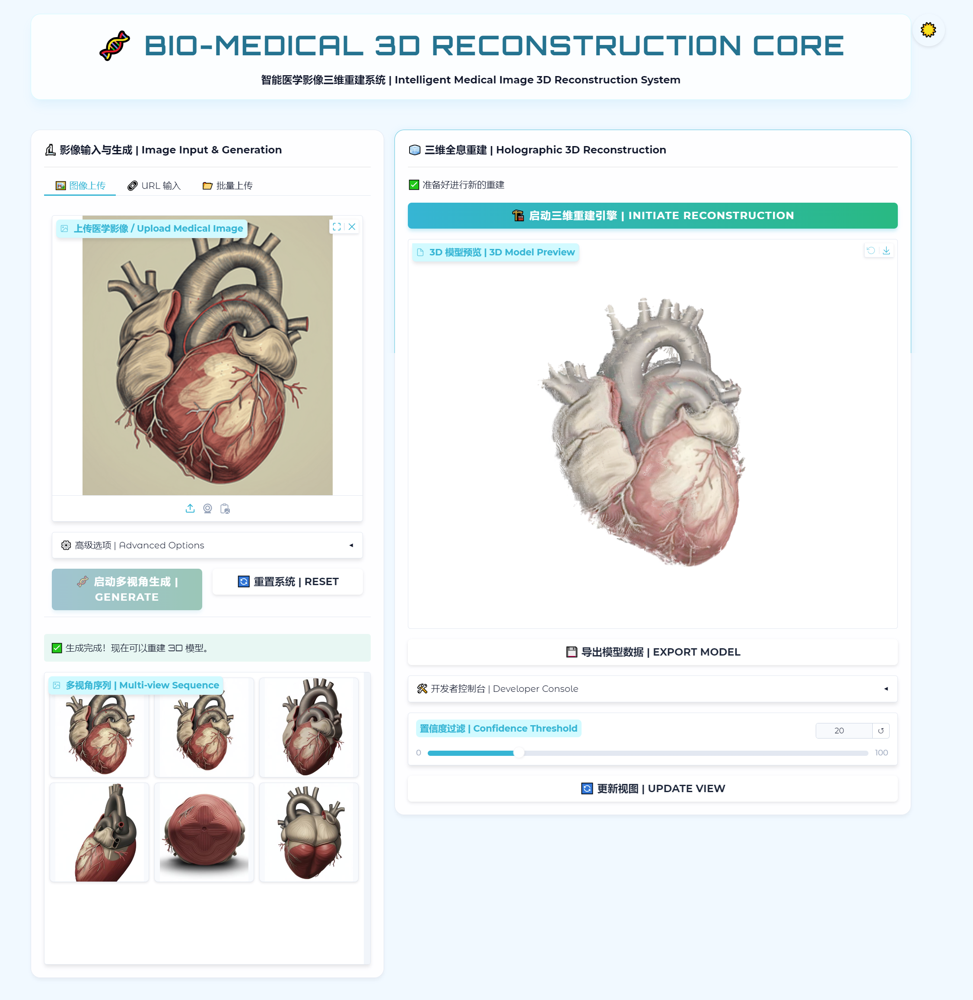
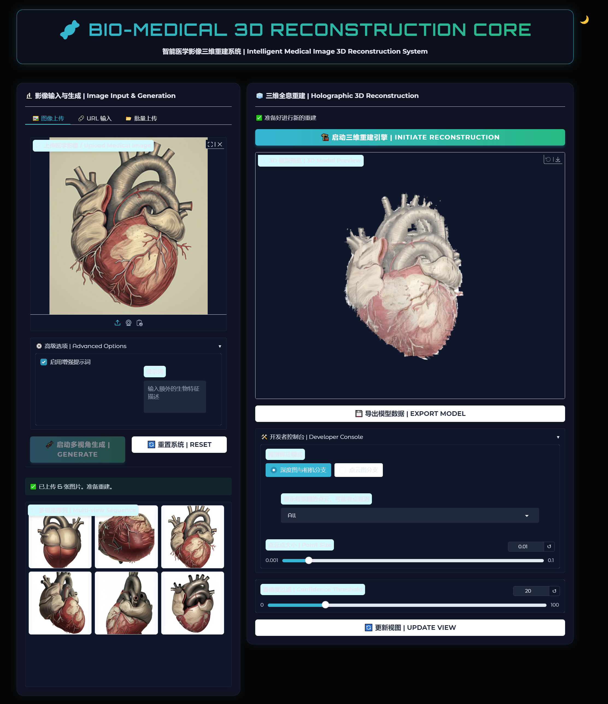

# 🧬 智能医学影像三维重建系统 (Bio-Medical 3D Reconstruction Core)

## 📖 项目简介
本项目是一个基于前沿人工智能技术的医学影像三维重建系统。它旨在解决传统三维重建需要大量多角度素材的痛点，通过单张二维医学图像即可快速生成高质量的三维模型。系统深度集成了图像生成大模型（Qwen-Image-Edit）与三维重建模型（VGGT，Pi3等），并配合极具科技感的 Web 交互界面，为医学可视化、教学及初步诊断提供强有力的工具支持。
其中基于Depth-anything3的框架具有导出3DGS模型的能力，基于Pi3的框架在重建效果上表现最好

> 💡 **镜像发布**: 基于AutoDL的镜像已经发布！！！可以一键部署搭建在AutoDL平台！如若需要请联系项目作者并提供AutoDL ID以便镜像分享

> 💡 **开发环境说明**：本项目基于 **AutoDL** 算力平台开发完成，核心推理环境运行于 **NVIDIA RTX 4090 (24GB)** 显卡。配套的 AutoDL 镜像即将发布，届时可一键部署。API由 **Modelscope** 平台提供，为了安全请在运行时替换为您对应的Modelscope API key.

## 📸 演示 (Demo)
<div align="center">
  
</div>
<div align="center">
  
</div>
<div align="center">
  
</div>
<div align="center">
  
</div>

## 🌟 核心功能特性

### 1. 多模态影像输入 (Multi-modal Input)
系统设计了灵活的输入方式以适应不同场景：
- **🖼️ 单图智能生成**：用户仅需上传一张正面医学影像，系统即可自动生成全套多视角图像。
- **🔗 URL 远程加载**：支持直接输入图片 URL，系统自动抓取并处理，适合云端资源。
- **📂 本地序列上传**：针对已有数据的场景，支持直接批量上传多视角图像序列，跳过生成步骤直接进行重建。

### 2. 智能辅助与安全 (Intelligent Assistant)
- **医学影像合规检测**：内置 Qwen-VL 视觉大模型，自动审核上传图片是否属于医学范畴，有效过滤无关内容。
- **提示词自动翻译**：支持中文提示词输入，系统自动调用 LLM 将其翻译为精准的英文描述，并进行 Prompt 增强以提升生成质量。

### 3. AI 多视角生成 (AI Multi-view Generation)
利用生成式 AI 技术，从单张图像推演物体的空间结构：
- **全方位视角**：自动生成正视图、顶视图、左视图、右视图、底视图及后视图。
- **背景处理**：减少背景噪声对三维重建的干扰。

### 4. 高精度三维重建 (3D Reconstruction)
- **三维重建**：集成多个三维重建模型，精准预测深度图与相机位姿。
- **灵活的预测模式**：支持“深度图与相机分支”及“点云图分支”两种预测模式。
- **参数实时调优**：提供置信度阈值（Confidence Threshold）滑块，用户可实时过滤低置信度点云，优化模型清晰度。

### 5. 沉浸式交互体验 (Immersive UI)
- **Bio-Tech 视觉主题**：定制化的生物科技风格 UI，采用蓝绿配色与磨砂玻璃质感。
- **日夜间模式切换**：内置光/暗主题切换功能（☀️/🌙），满足不同光照环境下的使用需求。
- **交互式 3D 预览**：集成 WebGL 3D 查看器，支持旋转、缩放、平移查看重建模型。
- **手动视图更新**：为了节省计算资源并提供更稳定的体验，视图更新采用手动触发机制。

## 📝 待办事项 (Todo List)

### ✅ 已完成 (Completed)
- [x] 基于 Gradio 的 WebUI 框架搭建
- [x] Bio-Tech 主题定制与 CSS/JS 深度美化
- [x] ModelScope API (Qwen) 接入与多视角生成逻辑
- [x] VGGT 模型推理流程打通
- [x] 进度条与状态反馈优化
- [x] 亮/暗色主题切换功能
- [x] 修复 `np.load` 兼容性问题
- [x] Depthanything3模型推理流程打通，引入3dgs视频，不过效果很差
- [x] Pi3 模型推理流程打通
- [x] 私人AutoDL镜像已打包

### 🚧 未来 进行中 / 未完成 (In Progress / Todo)

- [ ] 公开AutoDL镜像（需审核）
- [ ] 增加更多模型导出格式支持 (如 .ply, .obj)
- [ ] 引入更精细的医学图像分割预处理

## 🛠️ 运行说明

确保根据需要的模型，已按照其要求安装必要的依赖库（`gradio`, `torch`, `openai`, `numpy`, `Pillow` 等）或根据本项目requirements安装环境，并在本项目根目录下运行：

```bash
python integrated_demo_{model_name}.py
```

可通过demo/Testimage1, demo/Testimage2, demo_heart检验模型效果  
系统启动后，默认访问地址为 `http://0.0.0.0:6008`。

---
*Powered by Gradio, ModelScope & VGGT & Pi3 & Depth-anything3*
